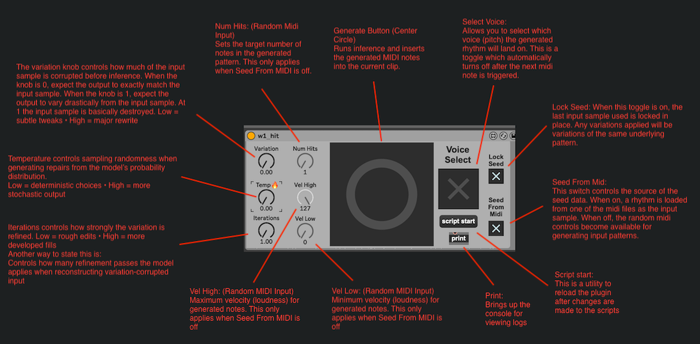

# 🎛 W1 Hit
### An AI-powered MIDI rhythm generator with Ableton Live integration

**Music is defined as a sound that repeats.**  
**Rhythm shares the same definition and thus is the basis of all music.**

## 🎥 Watch W1 Hit in Action

[](https://www.youtube.com/watch?v=ORlLNOC8kSM)



🇯🇲 Example songs created with W1 Hit:  
[Riddim 1](https://drive.google.com/file/d/1_0SbdAahy8-wQNbpLn0izOkheZ4mTRIL/view?usp=sharing)
[Riddim 2](https://drive.google.com/file/d/1A7YmxghzXO1f03oh6YUJPuZ4DZBoisaK/view?usp=sharing)
[Riddim 3](https://drive.google.com/file/d/1oqbPUerFjXpN8j4oxPI2FK8zR71hyeVt/view?usp=sharing)
[Riddim 4](https://drive.google.com/file/d/13NxNwOmxnKZjr7FRSggYpGjnPOHLx6pq/view?usp=sharing)
[Riddim 5](https://drive.google.com/file/d/1Y8xXVlmy-7nNVfhS2DGpz1uXMKqDiNDg/view?usp=sharing)

W1 Hit is an AI system for generating expressive single-voice drum patterns. It trains on MIDI rhythms and produces musically coherent variations, fills, and new sequences that can be inserted directly into Ableton Live using a Max for Live device.

Designed for producers, sound designers, and researchers, W1 Hit focuses on controllable generation rather than randomness — allowing users to shape output using parameters such as variation and temperature.

✨ Features

🧠 Trained on single-voice MIDI drum patterns  
🎚 Generate new rhythms and variations  
🥁 Velocity-aware output (not just note placement)  
🎛 Parameter-controlled generation  
⚡ Real-time Ableton Live integration  
🎹 MIDI-native workflow (no audio preprocessing)  

🧠 How It Works

W1 Hit trains a Temporal Convolutional Network (TCN) on quantized MIDI grids of 16th notes, 8 bars each, representing a single drum voice.
During inference, the model generates new patterns conditioned on:
* training data distribution
* input samples
* user-controlled parameters
  
This enables musically coherent results suitable for production workflows.

🎛 Use Cases

* Drum pattern generation for producers  
* Creating variations of existing grooves  
* AI-assisted composition tools  
* Symbolic music generation research  
* Max for Live instrument development  

📂 Project Structure

```
W1_Hit/
│
├── Max MIDI Effect/                  # Ableton integration. If you're an artist, you only need this folder
│   └── W1_Hit/                       # Root Directory for W1 Hit. Copy this to the Max MIDI Effect folder on your computer
│       ├── w1_hit.amxd               # Max for Live device
│       ├── w1_hit.js                 # Node for Max interface
│       ├── clipcmd_to_live.js        # MIDI insertion logic
│       ├── install/                  # Folder containing dependencies and utilities to install them
│       │   ├── install_mac.command   # Installs python dependencies for mac
│       │   ├── install_win.bat       # Installs python dependencies for windows
│       │   └── requirements.txt      # List of python dependencies
│       │
│       └── w1_hit_infer/             # Inference engine
│           ├── inference.py          # Runs inference on the model in the Loader dir. The output is sent back to a MIDI clip in Ableton Live
│           ├── hit_generator.py      # Contains the model definition. Basically a stripped down version of hit_generator.ipynb
│           ├── mid_to_velocity.py    # Used to load MIDI files used as seed data for inference
│           ├── Loader/               # Dir to store the model. inference.py loads the first model it finds in this folder
│           ├── MIDI/                 # Stores MIDI files to be used as training data and as seed data for inference
│           └── random_midi_input.py  # Generates MIDI data for use as the seed input to inference, in place of MIDI files
│
├── HitGenerator/                # Training pipeline. For the more technical minded
│   ├── hit_generator.ipynb      # Jupyter notebook containing model definition. The main function can be run to train the model
│   ├── mid_to_velocity.py       # Used to load MIDI files into the training set. Each voice in the MIDI is a new sample
│   ├── midi_export.py           # For testing inference. Generates a MIDI file from the models output data
│   ├── Models/                  # The output directory for trained models.
│   ├── rename_midis.ipynb       # A Jupyter notebook used as a utility for renaming midi samples to uuids
│   └── generated_midis/         # Output directory for MIDIs generated by inference
│
├── requirements.txt
└── README.md
```
🛠 Installation
1) Clone the repository
```
git clone https://github.com/david-a-campbell/W1_Hit.git
cd W1_Hit
```
2) Install Python dependencies
```
pip install -r requirements.txt
```
(Recommended: use a virtual environment)

### 3) Ableton Live Setup

1. Open Ableton Live  
2. Go to **User Library → Presets → MIDI Effects → Max MIDI Effect**  
3. Copy the entire folder: **Max MIDI Effect/W1_Hit/** from this repository into that directory  

⚠️ Important:  
Copy the folder itself, not the files inside it.  
The final path on your system should be: **User Library/Presets/MIDI Effects/Max MIDI Effect/W1_Hit/**  

📌 Required Folder Structure:  
After installation, the device file should be located at: **.../Max MIDI Effect/W1_Hit/w1_hit.amxd**  

## Thats all you need to run the Ableton Plugin if you want to use this as an artist. Below are steps to train your own AI model:

🚀 Quick Start
Train a model

Place MIDI files into the training dataset folder (called MIDI) and run:
```
python HitGenerator/hit_generator.py
```
Trained models will be saved in:
```
HitGenerator/Models/
```

Copy your trained model to:
```
Max MIDI Effect/w1_hit_infer/Loader
```

Generate patterns:
Inference is handled by:
```
Max MIDI Effect/w1_hit_infer/inference.py
```
This script loads a trained model and generates MIDI patterns.

Use inside Ableton Live:
1. Insert the Max for Live device on a MIDI track
2. Trigger generation
3. Generated patterns are inserted into the MIDI clip

🎚 Generation Parameters

W1 Hit exposes controllable parameters to shape output:
  * Variation — degree of deviation from input pattern
  * Temperature — randomness vs determinism
  * Iterations — Refinement passes  
These allow producers to dial in results that fit their groove.

🤝 Contributing
Contributions, issues, and suggestions are welcome.

🎧 About  
Created by W1NGY — a project exploring AI-assisted music production tools.

